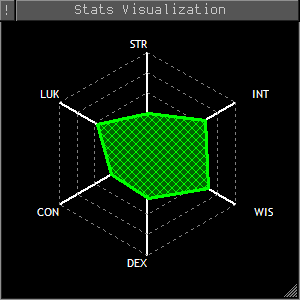

# Danj's Aardwolf plugins
After more than 20 years away from the MUD development community, Danj has returned to activity on Aardwolf MUD and is pleased to present his latest plugins.

## Danj_StatViz
This plugin allows you to visualize the 6 base trained stats (STR, INT, WIS, DEX, CON, LUK) on a spider graph in a mini window.

* `sv on` turns it on and updates it from `train` output.
* `sv off` turns it off.
* `sv update` updates it from `train` output if you already have the mini window open.
* `sv help` displays help information.

It's my first attempt at a MUSHclient plugin, so there are undoubtedly things that do not work as expected or do not conform to MUSHclient or Aardwolf client package norms; if you come across one of these cases, please create an issue on this GitHub giving as much information as possible.
