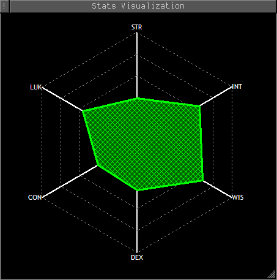

# Danj's Aardwolf plugins
After more than 20 years away from the MUD development community, Danj has returned to activity on Aardwolf MUD and is pleased to present his latest plugins.

## Danj_StatViz
This plugin allows you to visualize the 6 base trained stats (STR, INT, WIS, DEX, CON, LUK) on a spider graph in a mini window.

The gridlines represent percentages of the maximum you can currently train that stat to, as indicated by the output of `train`. Gridlines are displayed at 20% intervals.

* `sv on` turns it on and updates it from `train` output.
* `sv off` turns it off.
* `sv update` updates it from `train` output if you already have the mini window open.
* `sv help` displays help information.

It's my first attempt at a MUSHclient plugin, so there are undoubtedly things that do not work as expected or do not conform to MUSHclient or Aardwolf client package norms; if you come across one of these cases, please create an issue on this GitHub giving as much information as possible.

## Danj_DMAssist
**This plugin currently does not work properly! Please don't try to use it until it is fixed.**

Once it's working, this plugin will intelligently manage the casting of curse and dispel magic. It's not automatic, it just keeps track of whether your curses and dispels have failed or succeeded and will not cast curse or dispel magic again depending on the outcome.

* `dm` will attempt to curse and dispel magic your current target. If you're not currently in combat, it returns an error.
* `dm <target>` will attempt to curse and dispel magic the named target.
